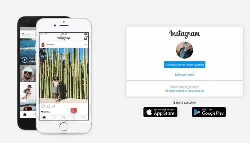

<h1 align="center">
UI-Clone-Login-Instagram
</h1>

Este projeto foi desenvolvido para fins de estudo, 
 esse repositório contem a interface da tela de Login do Instagram utilizando apenas HTML e CSS 

  
   

## Resultado da aplicação

    

## Objetivo do Projeto
O objetivo do projeto foi revisar conceitos basicos de responsividade com flex-box e ao mesmo tempo colocar em pratica alguns recursos visuais desenvolvido no repositorio <a href="https://github.com/rangelPereira/Desafio-CSS" targt="_blanck"> Desafio CSS</a>

## Oque foi praticado
Nesse projeto foi praticado tecnicas basicas de HTML e CSS para tornar o designe responsivo. Como um desafio extra, adicionei um pequeno slide utilizando animações com css e tambem foi adicionado algumas resgras extras de responsividade para monitores maiores e tablets.

## Tecnologias Utilizadas

- [X] HTML5
- [X] CSS3
- [X] Flex-box

## Deploy
O deploy da pagina foi feito atravez da plataforma Vercel  
Link do Deploy: https://ui-clone-login-instagram.vercel.app/
